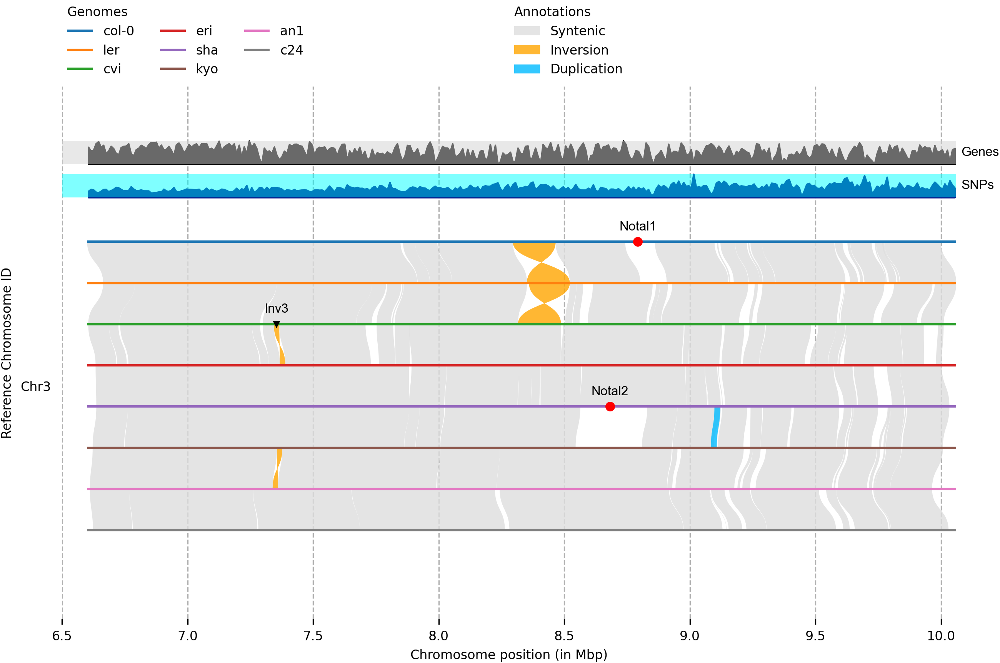

[](https://conda.anaconda.org/bioconda)
[](https://anaconda.org/bioconda/plotsr)
[](https://anaconda.org/bioconda/plotsr)

## Introduction
Plotsr generates high-quality visualisation of synteny and structural rearrangements between multiple genomes. For this, it uses the genomic structural annotations between multiple chromosome-level assemblies.


## Installation:
The easiest method to install plotsr is using anaconda:
```
conda install -c bioconda plotsr 
```
For manual installation the pre-requisites are:
1. Python >= 3.8
2. Python libraries. These can be installed in a conda environment using:
```
conda install numpy=1.21.2 pandas=1.2.4 matplotlib=3.3.4 setuptools
```
Then download plotsr and install:
```
git clone https://github.com/schneebergerlab/plotsr.git
cd plotsr
python setup.py install
```

After this plotsr should be installed and in your environment. Test it by printing the help message:
```
plotsr -h
```

## Inputs requirements
#### Minimal requirements
1. Chromosome-level assemblies or chromosome length information for the genomes to be compared 
2. Pairwise structural annotations between genomes

For example, if genomes A, B, and C are to be visualised in this order, then structural annotations of A vs B and B vs C genome comparisons would be required.

#### Additional inputs
* GFF/BED/bedGraph files for adding tracks to the visualisation, like the tracks for genes and SNPs in the [example](Example) plot above.
* Bed file containing genomic coordinates to add markers, like the markers for Inversion 3, Not aligned 1 in the [example](Example) plot above.

## Quick example for visualisation

As example, we would visualise structural rearrangements between four accessions of <i>Arabidopsis thaliana</i>. All required files are in the [example](./example/) folder. Following is the list of the important input files:
| File name|  File Description   |
|----|--------|
| `*.chrlen` | Table containing chromosome lengths |
| `*syri.filtered.out` | Pairwise structural annotation information between genomes |
| `genomes.txt` | [Genomes information file](#genomes) |
| `markers.bed` | [Markers information file](#markers.bed) |
| `tracks.txt` | [Tracks information file](tracks.txt) |
| `plotsr.sh` | Bash script containing commands to generate different visualisations for the four genomes |
| `base.cfg` | Configuration file for adjusting visual properties of the plot |

Use the following commands to generate an example plot:
```
cd example
gzip -d TAIR10_GFF3_genes.gff.gz
gzip -d 1001genomes.snps.sorted.bed.gz
plotsr --sr col_lersyri.filtered.out --sr ler_cvisyri.filtered.out --sr cvi_erisyri.filtered.out  --genomes genomes.txt --tracks tracks.txt -S 0.5 -o output_plot.png -W 7 -H 10 -f 8 --cfg base.cfg --markers markers.bed
```


## Pipeline for visualising genomic differences

Following are the steps for a typical pipeline to visualise structural annotations between genomes. For this, we would use the data available in the [example](./example/) folder.

#### Step 1: Aligning genomes
* In the ```example``` folder, assemblies for three strains of _Arabidopsis thaliana_ are available (Col-0: TAIR10.filtered.fa.gz, L<i>er</i>: ler.filtered.fa.gz, C<i>vi</i>: cvi.filtered.fa.gz).
* We would unzip and then align these genomes using minimap2 (v2.17).
```
# Unzip genomes
gzip -d TAIR10.filtered.fa.gz
gzip -d ler.filtered.fa.gz
gzip -d cvi.filtered.fa.gz

# Align genomes
minimap2 -ax asm5 -t 4 --eqx TAIR10.filtered.fa ler.filtered.fa \
 | samtools sort -O BAM - > col_ler.bam
samtools index col_ler.bam
minimap2 -ax asm5 -t 4 --eqx ler.filtered.fa cvi.filtered.fa \
 | samtools sort -O BAM - > ler_cvi.bam
samtools index ler_cvi.bam
```

#### Step 2: Finding structural annotations between genomes
* We use SyRI to get structural annotations between the genomes.
```
# Running syri for finding structural rearrangements between Col-0 and Ler
syri -c col_ler.bam -r TAIR10.filtered.fa -q ler.filtered.fa -F B --prefix col_ler &
# Running syri for finding structural rearrangements between Ler and Cvi
syri -c ler_cvi.bam -r ler.filtered.fa -q cvi.filtered.fa -F B --prefix ler_cvi &
```
This will generate col_lersyri.out and ler_cvisyri.out files that contain the structural annotations between genomes and will be the input to plotsr.

If other methods are used for finding structural annotations, then their output can be parsed to plotsr using the BEDPE format which should have the following columns:
```
Reference chromosome name
Reference start position
Reference end position
Query chromosome name
Query start position
Query end position
Annotation type
```
Acceptable values for annotation type: SYN, INV, TRA, INVTR, DUP, INVDP. Here:

| <!-- --> |  <!-- -->   |
|----|--------|
| SYN | Syntenic |
| INV | Inversion |
| TRA | Translocation |
| INVTR | Inverted translocation |
| DUP | Duplication |
| INVDP | Inverted duplication |

<b><i>NOTE</b>: The BEDPE file must have syntenic region annotations. These are required to group homologous chromosomes from different genomes. Syntenic regions can only be between homologous chromosomes. </i>


#### Step 3: Running plotsr
Plotsr can be run using the following command: 
```
plotsr \
    --sr col_lersyri.out \
    --sr ler_cvisyri.out \
    --genomes genomes.txt \
    -o ampril_horizon.png
```
<a name="genomes">
Here, genomes.txt is a tab-separated file containing the path and names for the genomes. A third column can also be added to customise the visualisation of genomes.
</a>
```
$genomes.txt
#file	name	tags
TAIR10.filetered.fa	col-0	lw:1.5
ler.filtered.fa	ler	lw:1.5
cvi.filtered.fa	cvi	lw:1.5
```
Currently, the following tags are available for genomes.
```
ft = File type (fa/cl for fasta/chromosome_length, default = fa); cl files must be in tsv format with chromosome name in column 1 and chromosome length in column 2
lw = line width
lc = line colour
```
<b><i>NOTE</b>: It is required that the order of the genomes is the same as the order in which genomes are compared. For example, if the first genome annotation file uses GenomeA as a reference and GenomeB as query, and the second genome annotation file uses GenomeB as a reference and GenomeC as query, then the genomes file should list the genomes in the order GenomeA, GenomeB, GenomeC.</i>

## Tracks and markers
In addition to structural annotations, plotsr can also be used for visualising tracks for genomics features as well as for marking specific positions in the genomes.

#### Visualising tracks
Feature track information should be in BED or bedGraph format and should correspond to the first genome in visualisation (here for an example: col-0). Plotsr would then calculate and plot the relative frequency of these features in bins along the chromosomes.
Feature tracks are parsed to plotsr as a tab-separated file containing the path and names for the tracks. The visualisation properties of the tracks can be adjusted by providing a third column containing different tags and corresponding values.
![tracks.txt]
```
$tracks.txt
# file	name	tags
TAIR10_GFF3_genes.gff   Genes   ft:gff;bw:10000;nc:black;ns:8;nf:Arial;lc:blue;lw:4;bc:lightblue;ba:0.5
1001genomes.snps.sorted.bed     SNPs    bw:10000;nc:black;ns:8;nf:Arial;lc:sienna;lw:1;bc:peachpuff;ba:0.5
Giraut2011_centromeres.bed     Centromeres     bw:10000;nc:black;ns:8;nf:Arial;lc:olive;lw:1;bc:palegreen;ba:0.5
```
Currently, the following tags are available for tracks.
```
ft = File type (bed/bedgraph/gff, default = bed)
bw = bin width (default=100000)
nc = name colour
ns = name size
nf = name font
lc = line colour
lw = line width
bc = background colour
ba = background alpha
```

#### Visualising Markers
Plotsr can mark positions of interest in the genomes. Markers are provided as an extended BED file with five columns: chromosome name, start position, end position, genome name, tags (optional)
![markers.bed]
```
$markers.bed
#chr	start	end genome_id	tags
Chr3	7354325	7354326	cvi	mt:v;mc:black;ms:3;tt:Inv3;tp:0.02;ts:8;tf:Arial;tc:black
Chr4	4571491	4571492	cvi	mt:v;mc:black;ms:3;tt:Inv1;tp:0.02;ts:8;tf:Arial;tc:black
Chr5	5991438	5991439	c24	mt:^;mc:black;ms:3;tt:Inv2;tp:-0.07;ts:8;tf:Arial;tc:black
Chr3	8792851	8792852	col-0	mt:.;mc:red;ms:10;tt:Notal1;tp:0.02;ts:8;tf:Arial;tc:black
Chr3	8682034	8682035	sha	mt:.;mc:red;ms:10;tt:Notal2;tp:0.02;ts:8;tf:Arial;tc:black
```
The visualisation properties of the markers can be adjusted by adjusting tag values. Currently, the following tags are available for tracks.
```
mt = marker type
mc = marker colour
ms = marker size
tt = text
tc = text colour
ts = text size
tf = text font
tp = text position
```
Check [markers.txt](config/marker_point_type.txt) for the list of available markers.

## Adjusting other parameters
Additional parameters (colors, spacing, legends) of the plot can be adjusted by parsing a config file to the `--cfg` parameter. Description and default values present in the example [base.cfg](./example/base.cfg) file.   

## Citation:
If you find plotsr helpful, please cite:

`Goel, M., Schneeberger, K., plotsr: Visualising structural similarities and rearrangements between multiple genomes. bioRxiv 2022.01.24.477489, doi.org/10.1101/2022.01.24.477489`